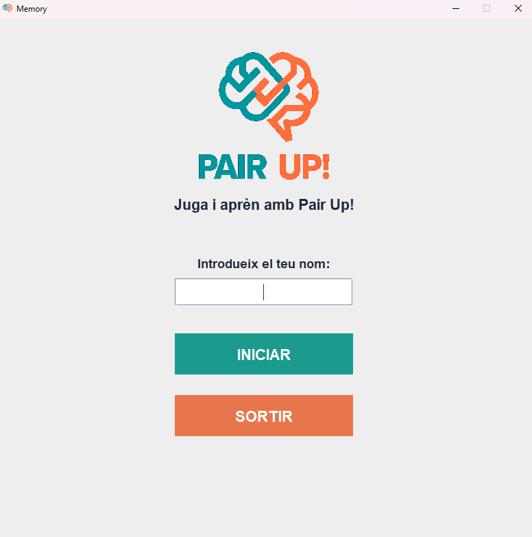
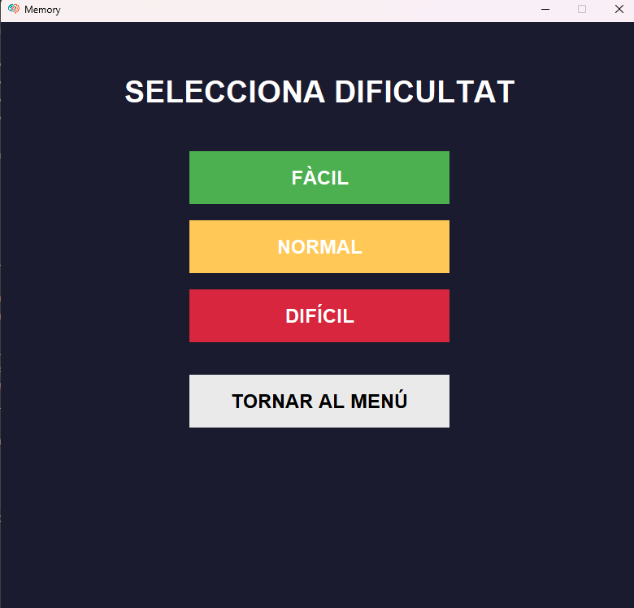
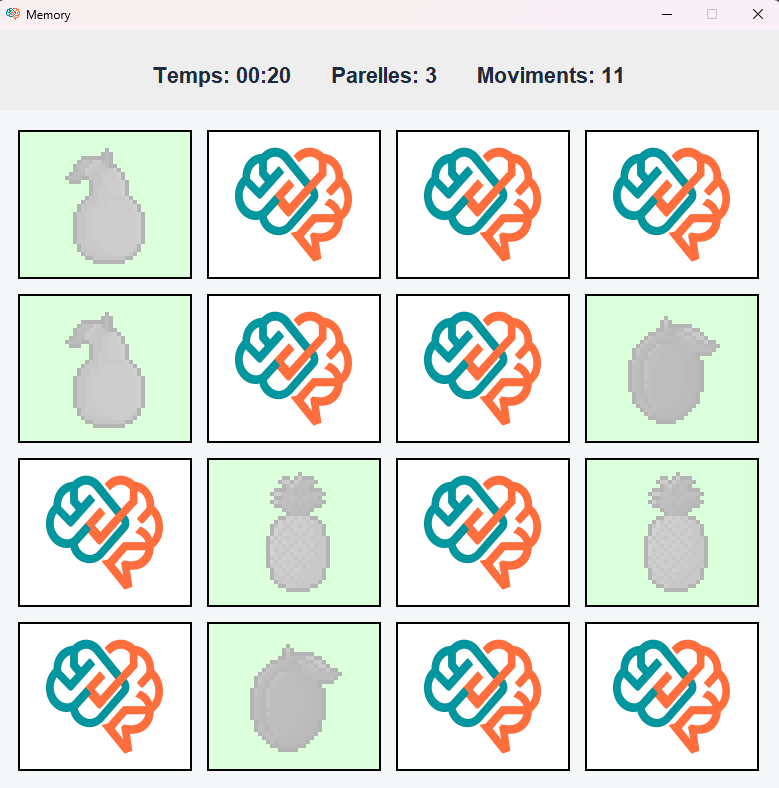
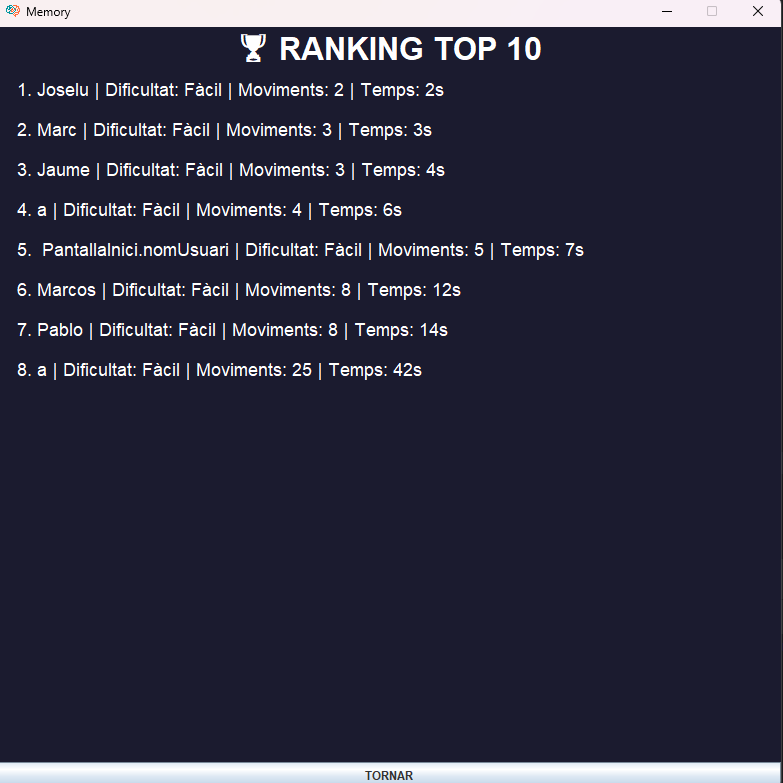

# 🧠 Memory - Pair Up

## 📖 Descripció del projecte

**Memory - Pair Up** és un joc desenvolupat en Java amb Swing on l’objectiu és trobar totes les parelles d’imatges en el menor temps i amb el mínim nombre de moviments possibles.

El jugador pot introduir el seu nom, seleccionar la dificultat i jugar en un tauler dinàmic amb diferents nivells de complexitat. Les partides es guarden en una base de dades MySQL.

---

## 🎮 Característiques principals

- Sistema de menú inicial amb introducció de nom
- Selecció de dificultat:
  - Fàcil
  - Normal
  - Difícil
- Tauler de joc dinàmic segons dificultat
- Sistema de temps i comptador de moviments
- Detecció de parelles correctes/incorrectes
- Guardat de partides en base de dades MySQL
- Interfície gràfica amb Java Swing

---

## 🗄️ Base de dades

El projecte utilitza MySQL amb dues taules principals:

### `usuaris`
- id_user (PK)
- user (nom d’usuari)

### `partida`
- id_partida (PK)
- dificultat
- moviments
- temps
- date
- id_user (FK)

---

## 🚀 Com executar el projecte

### 1. Requisits
- Java JDK 17 o superior
- MySQL Server
- IntelliJ IDEA (recomanat)
- MySQL Connector J

---

### 2. Configurar la base de dades

Executa aquest script SQL:

```sql
drop database if exists Projecte_Lliure;
create database Projecte_Lliure;
use Projecte_Lliure;

create table usuaris (
id_user int auto_increment primary key,
user varchar(50) unique
);

create table partida (
id_partida int auto_increment primary key,
dificultat int,
moviments int,
temps int,
date datetime default current_timestamp,
id_user int,
foreign key (id_user) references usuaris(id_user)
);
```

## 📸 Fotografías del proyecto

A continuación se muestran diferentes capturas del funcionamiento del juego **Memory - Pair Up**.

---

### 🖥️ Pantalla de inicio


---

### 🎮 Selección de dificultad


---

### 🧠 Pantalla de juego


---

### 🏁 Pantalla de victoria


---
